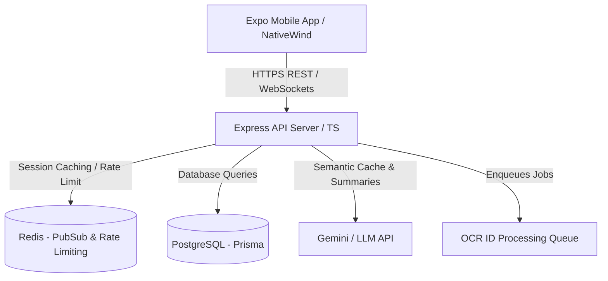
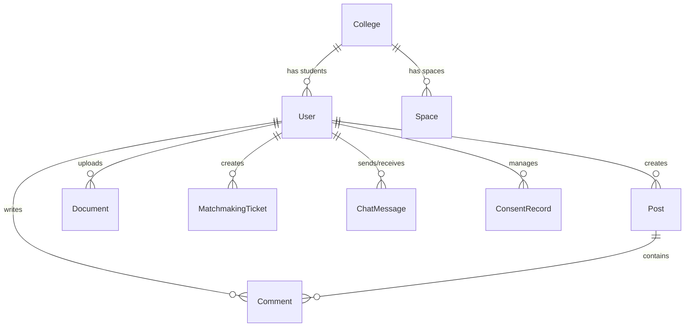

# System Architecture - Workly

This document describes the high-level architecture, module design, database schemas, and data flow patterns for the Workly platform.

---

## 1. High-Level Architecture Overview

Workly is structured as a monorepo consisting of a backend Express server and an Expo React Native mobile client. 



### Components:
1.  **Mobile Client:** Built using **React Native (Expo)** with **TypeScript**, styled using **NativeWind (Tailwind CSS)**. It handles navigation via a modular tab navigator and uses Sentry for crash reporting and PostHog for user analytics.
2.  **API Backend:** A **Node.js Express** app written in **TypeScript**. It provides REST endpoints for features like feed, marketplace, matchmaking, and chat.
3.  **Real-time Communication:** Built using **Socket.io** over WebSockets. Scale is achieved by configuring a **Redis Pub/Sub adapter** to distribute socket events across multiple server processes.
4.  **Database Layer:** **PostgreSQL** managed using **Prisma ORM**. PostgreSQL also handles fuzzy string matching using the `pg_trgm` extension for college name searching.
5.  **AI Assistant & Summarizer:** Powered by **Google Gemini API**. A custom semantic cache store (embedding calculations) is implemented on top of PostgreSQL to avoid duplicate Gemini requests for identical academic questions.
6.  **Async Processing Queues:** Handles OCR processing for college ID verification and document summarization. Deploys a light in-process worker model that is easily migratable to BullMQ.

---

## 2. Directory Structure

```
Workly/ (Monorepo Root)
├── package.json              # Configures root npm workspaces
├── apps/
│   ├── server/               # Express backend application
│   │   ├── Dockerfile
│   │   ├── package.json
│   │   ├── tsconfig.json
│   │   ├── prisma/
│   │   │   ├── schema.prisma # Prisma database models
│   │   │   └── migrations/   # SQL migration files
│   │   └── src/
│   │       ├── server.ts     # Main application bootstrap
│   │       ├── controllers/  # Route handlers (auth, feed, billing, etc.)
│   │       ├── middleware/   # Security, Auth token extraction, file upload
│   │       ├── utils/        # Socket helpers, OCR queue, AI semantic cache
│   │       └── scripts/      # Database seeding and index creation
│   │
│   └── mobile/               # React Native Expo mobile application
│       ├── App.tsx           # Mobile bootstrap and Sentry/PostHog config
│       ├── tailwind.config.js# Custom design system configurations
│       └── src/
│           ├── components/   # Reusable UI widgets & Theme providers
│           ├── context/      # AuthContext for session management
│           ├── hooks/        # Reactive hooks
│           └── screens/      # Tab screens (Home, Chat, Market, Profile, etc.)
```

---

## 3. Database Schema

The relational schema is configured in `apps/server/prisma/schema.prisma`. Below is the data model map:



### Models Table:
*   **User:** Stores profile information, branch, semester, current wallet balance, premium subscription status, and credentials bcrypt hash.
*   **College:** Represents official colleges in India. Includes AISHE government code registry fields (`state`, `district`, `managementType`).
*   **Space:** Logical channels (e.g. `#notes`, `#pyqs`) scoped to a specific college.
*   **Post:** User-generated feed posts. Includes lists of media URLs and tag metadata.
*   **Comment:** Standard replies linked to a Post.
*   **Document:** PDF/Word note documents uploaded by students for buying and selling. Holds upvote counts, flag counts, and the AI-generated bullet summaries.
*   **MatchmakingTicket:** Represents a project partner finder entry, specifying the project overview, skills required, and the target role needed.
*   **ChatMessage:** Standard chat logs tracking sender, receiver, and message content.
*   **SemanticCache:** Cache for AI academic questions. Stores a hash/query and its generated answer alongside a stringified vector json for distance calculation.
*   **ConsentRecord:** Tracks compliance logs for DPDP compliance (e.g., PROFILE_SHARING, MARKETING consent).

---

## 4. Key Architectural Data Flows

### A. Real-Time Chat Message Flow
```
Client A ── Emits message ──> Socket.io Server (Server 1)
                                      │
                              Publishes event
                                      ▼
                              Redis Pub/Sub
                                      │
                              Distributes event
                                      ▼
Client B <── Emits message ── Socket.io Server (Server 2)
```

### B. College ID Card Verification Flow
```
Client ── Upload ID (Image) ──> Web Server
                                    │
                           compressAndSave (Sharp webp)
                                    │
                           Store image path & Enqueue OCR job
                                    │
                                    ▼
                          Tesseract OCR Workers
                                    │
                       (Extract text & match name/AISHE)
                                    │
                        Updates User status to verified
```

### C. AI Q&A Semantic Caching Flow
```
User asks question ──> Server
                          │
                  Calculate Embedding & search SemanticCache
                          │
            ┌─────────────┴─────────────┐
     Cache Match?                  Cache Miss?
            ▼                           ▼
    Return cached response         Call Gemini API
                                        │
                                   Save to Cache
                                        │
                                 Return response
```
